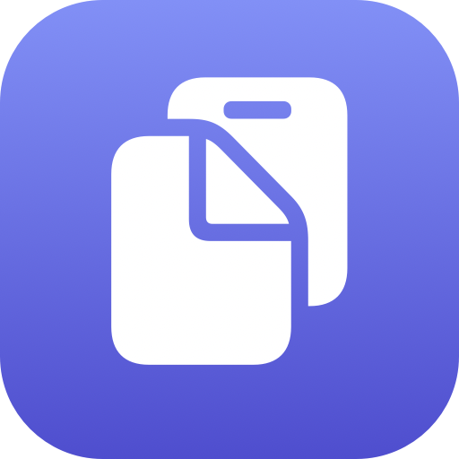

<p align="center">
  
</p>

<h1 align="center">ClipBar</h1>

<p align="center">macOS için native bir menü bar (status bar) pano geçmişi uygulaması. Swift ve SwiftUI ile yazıldı.</p>

## Ne işe yarar

Panoya kopyaladığın son öğeleri (varsayılan 25, Ayarlar'dan 1-100 arasında değiştirilebilir) menü bar'daki simgeden açılan popover üzerinden listeler. İçerik türüne göre otomatik olarak ayırt eder:

- **Metin** — düz metin olarak listelenir
- **Link** — tıklayınca tarayıcıda açılır
- **Renk kodu** (`#RRGGBB`) — yanında renk önizleme kutucuğu ile gösterilir; üzerine gelince otomatik büyür
- **Görsel** — küçük önizleme; üzerine gelince otomatik büyür, tıklayınca ayrı bir pencerede tam boyut açılır

Her öğenin yanındaki ikonla tek tıkla tekrar panoya kopyalanabilir. Bir öğeye sağ tıklayıp **Sabitle**'ye basarsan raptiye rozetiyle işaretlenir ve liste ne kadar dolarsa dolsun her zaman en üstte kalır. Geçmiş, uygulama kapatılıp açılsa bile korunur (diskte saklanır).

## Özellikler

- Menü bar'da native popover arayüz (macOS Human Interface Guidelines'a uygun)
- Gösterilecek öğe sayısı Ayarlar penceresinden yapılandırılabilir (varsayılan 25, en fazla 100); kapasite aşılınca en eski öğe otomatik düşer
- Sağ tık menüsünden öğe sabitleme — sabitlenenler raptiye rozetiyle işaretlenir, her zaman listenin en üstünde kalır ve kapasite dolduğunda silinmez
- Akıllı içerik algılama: metin / link / renk kodu / görsel
- Renk ve görsel küçük resimlerinin üzerine gelince otomatik büyüyen önizleme (tıklamaya gerek yok)
- Görsellere tıklayınca ayrı bir pencerede tam boyut önizleme
- Kalıcı geçmiş (`~/Library/Application Support/ClipBar`)
- Açık/Koyu mod anahtarı (menü bar başlığındaki güneş/ay ikonu)
- Kendi uygulama ikonu (`Resources/AppIcon.icns`, `build_app.sh` tarafından pakete gömülür)
- Panoyu hafif bir `NSPasteboard` kontrolüyle izler; uykuda hiç çalışmaz, uyanıkken ölçülemeyecek kadar düşük CPU/pil etkisi

## Gereksinimler

- macOS 14 veya üzeri
- Xcode Command Line Tools (Xcode uygulamasının kendisi gerekmez)

## Çalıştırma

Proje bir Swift Package — Xcode açmadan terminalden çalıştırılabilir:

```bash
swift run
```

Kalıcı bir uygulama olarak (`.app`) kurmak için:

```bash
./build_app.sh
```

Bu, ikonu da gömülü şekilde `ClipBar.app` dosyasını üretir; `/Applications` klasörüne sürükleyip normal bir uygulama gibi kullanabilirsin (Finder'da aynı disk içi sürükleme *taşıma* yapar, dosya proje klasöründen kalkar — istersen `build_app.sh`'i tekrar çalıştırarak yeniden üretebilirsin).

## Teknik yapı

- SwiftUI `MenuBarExtra` (menü bar arayüzü)
- `NSPasteboard` polling (pano izleme)
- JSON + PNG dosyaları ile yerel kalıcılık, üçüncü parti bağımlılık yok
- Merkezi `HoverPreviewController` ile tek seferde tek öğe büyütme (hover önizlemesi gerçek pencere değil, fare olaylarını yakalamayan bir SwiftUI overlay)
